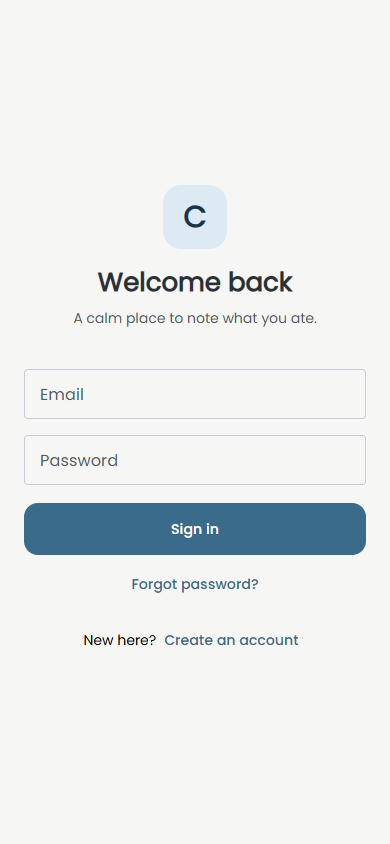
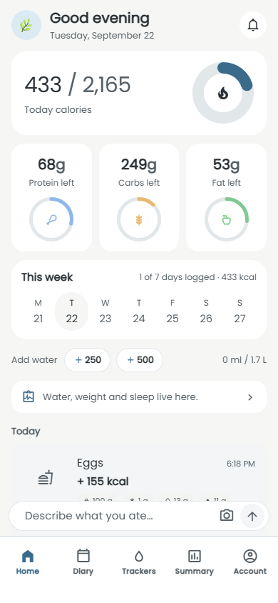
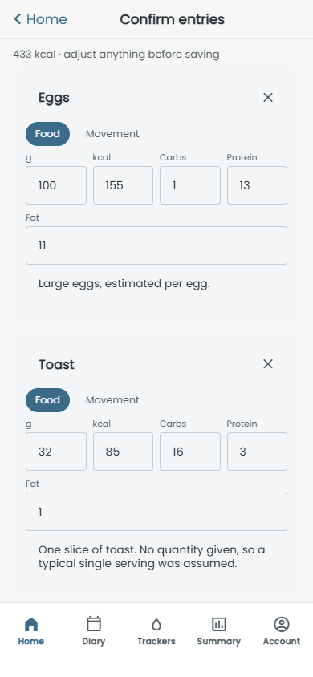
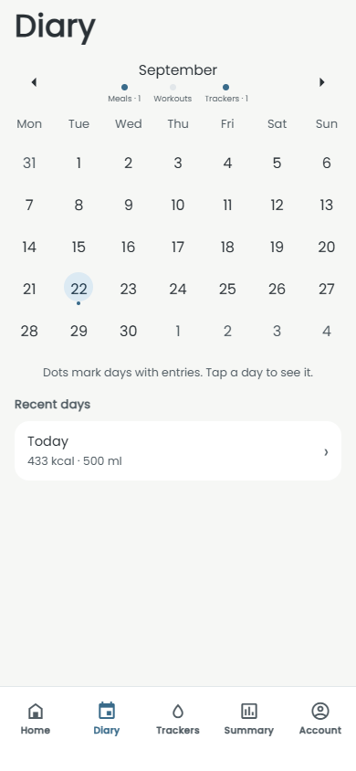
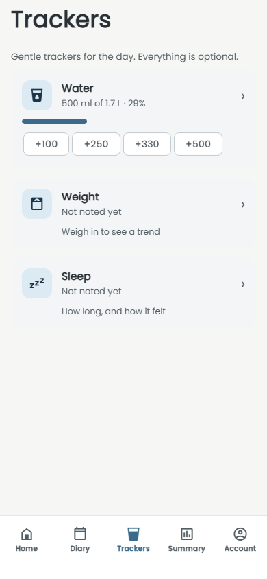
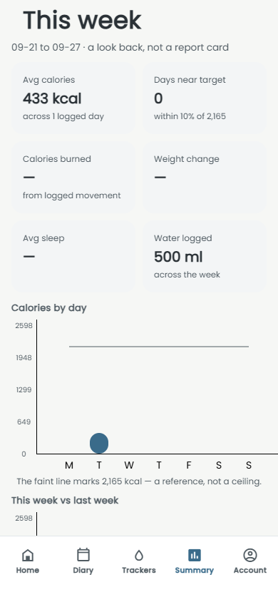
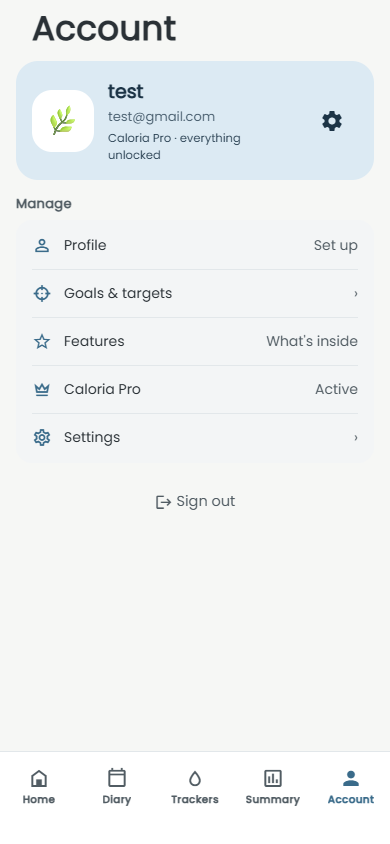

# Caloria

An AI-powered food and exercise diary for iOS, Android, and the web. Type a
sentence like "two eggs, toast and a latte" — or snap a photo of your plate —
and get an itemized calorie and macro breakdown to confirm and save. Calm by
design: no streaks, no red warnings, no shaming copy. Just a clear, neutral
picture of your day.

Built with Expo (managed workflow) and TypeScript. A built-in mock API parses
entries locally, so the whole app runs with no backend.

## Screenshots

### Welcome

The sign-in screen. Any credentials work in mock mode.



### Home

Today's calories against target, remaining macros, the week strip, water
quick-adds, and the log bar where a sentence becomes an entry.



### Confirm entries

Parsing "two eggs, toast and a latte" returns three itemized cards. Every
number is editable before saving.



### Diary

A month calendar marks days with entries. Tap a day to open its detail view.



### Trackers

Water with one-tap amounts, plus weight and sleep. All optional, all neutral.



### Weekly summary

Stat tiles and a calories-by-day bar chart for the week, with your target as a
faint reference line — not a ceiling.



### Account

Profile, goals and targets, the Pro paywall, and settings for units and the
daily reminder.



## What works

- **Text logging** — type a sentence on the Home bar, confirm the itemized
  cards, save. Two taps from thought to saved.
- **Photo logging** — camera or gallery, compressed before the parse request,
  same confirm step.
- **Edit, re-analyze, and delete** any entry.
- **Diary** — calendar of logged days with a per-day detail view.
- **Trackers** — water quick-adds, weight trend chart, sleep hours and quality.
- **Weekly summary** — stat tiles and a bar chart of the week's calories.
- **Account** — profile, editable targets, paywall, settings (units, reminder).
- **Light and dark mode**, following the OS.
- **Meal templates** — save a day's meals and reuse them later.

## Tech stack

| Layer | Choice |
| --- | --- |
| Framework | Expo SDK 57, React Native 0.86, React 19 |
| Language | TypeScript (strict) |
| Navigation | React Navigation 7 (bottom tabs + native stacks) |
| Server state | TanStack React Query 5 |
| Client state | Zustand 5 |
| UI | React Native Paper (MD3), Poppins type |
| Persistence | expo-sqlite on native, AsyncStorage on web |
| Payments | RevenueCat (simulated paywall without keys) |
| Tests | Vitest |

## Project structure

```
src/
  api/          ApiClient contract; HttpApi (real) + MockApi (local)
  db/           expo-sqlite repositories — the persistence boundary
  services/     Mifflin-St Jeor targets, RevenueCat, notifications, food DB
  stores/       zustand: session, preferences, toasts
  hooks/        react-query hooks over the repos
  theme/        light/dark Paper themes; no alarm red anywhere
  screens/      auth, onboarding, home, logging, diary, trackers, summary, account
  components/   shared UI (calorie ring, macro tiles, entry list)
  types/        shared TypeScript contracts
docs/BACKEND.md   exact endpoints and the server-side parse prompt
```

## Run it

```bash
npm install
npm start
```

Then press `i` for the iOS simulator, `a` for Android, or scan the QR code with
Expo Go. For the web build:

```bash
npm start -- --web
```

Metro serves on `http://localhost:8081`. No backend is needed — the mock API
parses entries locally.

## Configuration

Copy `.env.example` to `.env` and fill in what you need:

```
EXPO_PUBLIC_API_BASE_URL=        # leave empty for the built-in mock API
EXPO_PUBLIC_REVENUECAT_IOS_KEY=  # leave empty for the simulated paywall
EXPO_PUBLIC_REVENUECAT_ANDROID_KEY=
```

Setting `EXPO_PUBLIC_API_BASE_URL` switches the whole app to the HTTP client;
the exact request and response shapes are in
[`docs/BACKEND.md`](docs/BACKEND.md). All LLM calls belong server-side.

## Tests

```bash
npm test
```

Vitest covers the parser and the target calculations.

## Design principles

- **Describe, don't judge.** Over-target reads as "2,300 of 2,100 today" in a
  muted tone — never a warning, never red.
- **No gamification.** No streaks, no badges, no guilt.
- **Speed is the product.** Logging is the shortest possible flow.

## License

See [LICENSE](LICENSE).
